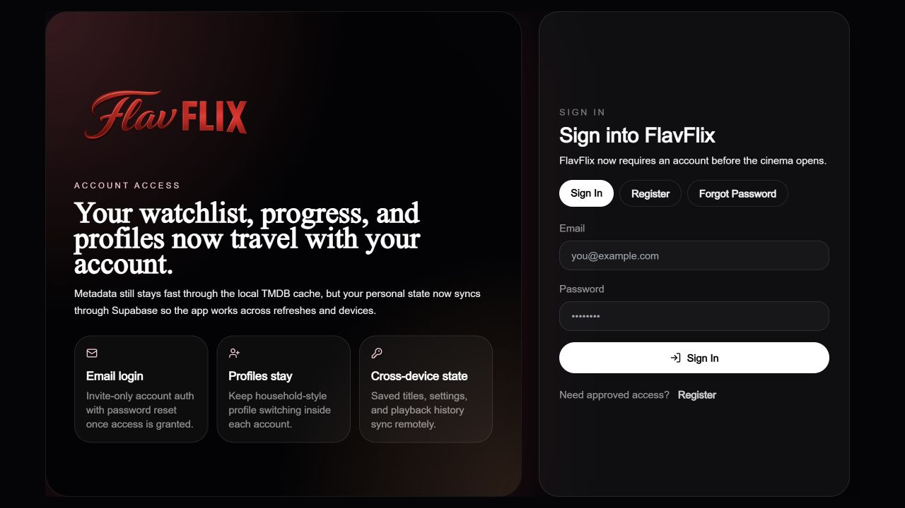

# FlavFlix Showcase

FlavFlix Showcase is the public, interactive demonstration of my private FlavFlix project: a cinematic movie and TV hub built with Next.js, React, Tailwind CSS, TMDB, and OMDb.

**Live demonstration:** [flavflix-showcase.vercel.app](https://flavflix-showcase.vercel.app)

[](https://github.com/im24a-gesztelyif/flavflix-showcase/actions/workflows/ci.yml)



> [!IMPORTANT]
> This repository is the portfolio showcase, not the complete private FlavFlix codebase. It runs without accounts or a cloud database, stores showcase data only in the visitor's browser, and limits playback of each movie or TV episode to five minutes.

## What you can demonstrate

- Browse movie and TV discovery rails backed by live TMDB metadata
- Search titles, people, and production companies
- Open movie, series, season, episode, collection, person, and company pages
- View OMDb rating enrichment when configured
- Create and manage up to four local profiles
- Save titles and maintain local watch history, progress, preferences, and continue-watching rows
- Open film and episode playback through embedded third-party sources
- Switch between available playback sources when necessary
- Use the responsive desktop and mobile interface

## The five-minute preview

Each movie or TV episode receives a maximum five-minute preview in this showcase. The allowance is stored locally per profile and title, survives page refreshes and source changes, and cannot be restarted by reopening the same title. When the time expires, the embedded player is removed and the visitor can return to browse another title.

This limit applies to the showcase only. It keeps the public deployment focused on demonstrating the application, its interface, and its state management.

## Playback and content disclaimer

FlavFlix does not host, upload, store, or distribute films or television content. Playback, availability, subtitles, and player behaviour are supplied entirely by independent third-party providers embedded by the application. Those services are not operated or controlled by this project.

Movie and television metadata and images are supplied by TMDB, with optional ratings from OMDb. FlavFlix is a personal educational and portfolio project and is not affiliated with Netflix, TMDB, OMDb, any playback provider, studio, broadcaster, or rights holder.

## Run the showcase locally

```bash
npm install
cp .env.example .env.local
npm run dev
```

Add your server-side metadata API credentials to `.env.local`:

| Variable | Purpose |
|---|---|
| `TMDB_READ_TOKEN` | Required TMDB read access token |
| `OMDB_API_KEY` | Optional OMDb ratings key |
| `NEXT_PUBLIC_TMDB_LANGUAGE` | Default metadata language |
| `NEXT_PUBLIC_TMDB_REGION` | Default regional setting |

No Supabase project, database, login, or account configuration is required. Profiles and application state use browser `localStorage` specifically for this public demonstration.

## About the full project

The private FlavFlix project includes the broader development implementation and account-backed version. This public repository is deliberately separated so recruiters and other visitors can explore a safe, self-contained demonstration without registration while still seeing the real discovery, profile, state, responsive UI, API, and time-limited playback work.
